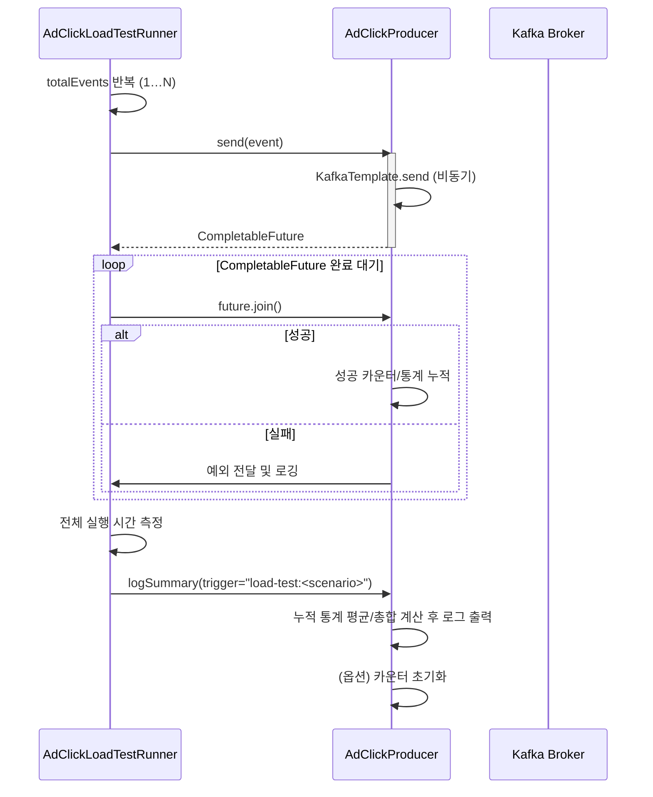

# AdClickLoadTestRunner 배치 동작 정리

## 실행 조건
- `ad-clicks.load-test.enabled=true`로 설정된 경우 애플리케이션 기동 시 자동 실행
- `totalEvents`로 지정된 건수(예: 1,000,000건)가 0보다 커야 동작
- `scenarioLabel`은 로그·요약 통계에 사용되는 태그

## 처리 흐름 요약

## 단계별 상세
1. **이벤트 생성 및 전송 요청**
   - `repeat(totalEvents)`를 돌면서 `AdClickEvent`를 생성
   - `Producer.send`는 `KafkaTemplate`을 통해 비동기 전송하고 즉시 `CompletableFuture` 반환
   - 반환된 Future를 `pendingResults` 리스트에 모아둠

2. **전송 완료 대기**
   - 모든 Future에 대해 `join()`을 호출해 전송 완료 여부를 확인
   - 실패 시 첫 예외를 바로 던져 배치를 중단하며 로그에 남김

3. **종료 시점 로깅**
   - 배치 종료 후 전체 소요 시간(ms)을 계산해 로그로 출력
   - 이어서 `AdClickProducer.logSummary("load-test:<scenario>")`를 호출해 누적된 메시지 크기/전송 시간 통계를 기록
   - `logSummary`는 성공·실패 건수, 평균 크기, 평균 지연, 총합 등을 로그로 남기고, 기본적으로 카운터를 초기화함

## 주의 사항
- `KafkaTemplate`이 메시지를 내부적으로 배치 처리하므로 실제 벽시계 기준 실행 시간은 평균 지연 * 건수와 다를 수 있음.
- 총 전송 시간(`totalDurationMillis`)은 각 메시지의 지연을 모두 합한 값이며, 실제 배치 완료 시간보다 훨씬 길게 나타남.
- 테스트를 반복 실행할 경우 `logSummary` 호출이 카운터를 초기화하므로, 새로운 배치마다 누적 통계를 독립적으로 확인 가능.
- `totalEvents`가 매우 크면 Future 리스트 메모리 사용량이 증가하므로, 필요 시 스트리밍 방식(예: 순차 join)으로 변경 고려.

## 관련 설정 요약
- `ad-clicks.load-test.enabled`: 배치 실행 여부 (기본 false)
- `ad-clicks.load-test.total-events`: 전송할 총 건수
- `ad-clicks.load-test.scenario-label`: 통계 로그에 표시될 시나리오 이름
- `ad-clicks.producer.serializer`: 값 직렬화 방식 (spring-json, jackson-object-mapper, kotlinx-json)

이 문서는 배치 테스트의 흐름과 로그 해석 방법을 빠르게 이해하려는 팀원이 참고하도록 작성했습니다.
